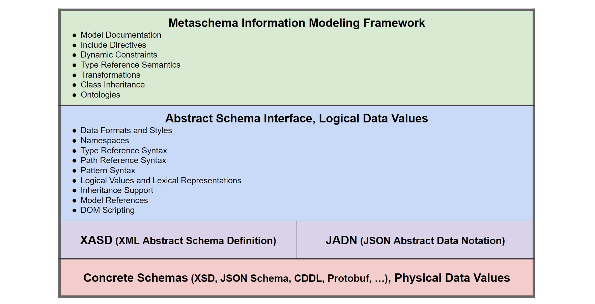

# Metaschema and Data Models

The [Metaschema Information Modeling Framework](https://pages.nist.gov/metaschema/):

> Provides a common, format-agnostic modeling framework supporting schema, code,
> and documentation generation all in one".
>
> Current modeling technologies (i.e. XML Schema, JSON Schema, Schematron) are:
> * Uneven in their modeling expressiveness and validation capability
> * Bound to specific formats (i.e., XML, JSON, YAML)

The Metaschema framework includes a "built-in data model". RFC 3444 distinguishes between:
* **Information Model**: models managed objects in a manner independent of data transport details,
can be specified informally or by using a formal Abstract Data Modeling language such as UML, ASN.1, or JADN
* **Data Model**: models data objects using a Concrete Data Modeling language such as XSD for XML data,
JSON Schema for JSON data, or CDDL for CBOR data.

Figure 1 conceptually divides an information modeling framework into three layers:
1. Concrete schemas and format-specific data (the Data Model)
2. Abstract schemas and format-agnostic application state (the Information Model)
3. Everything else including documentation and transformations (the Framework)

An Abstract Data Model API between the Framework and Information/Data layers would
allow Framework functions to be applied uniformly to all data formats.  RDF defines
[Datatype](https://www.w3.org/TR/rdf12-concepts/#section-Datatypes) as consisting of
a lexical space, a value space, and a lexical-to-value mapping, but is based on XML Schema
definitions of both the lexical space (a set of Unicode strings) and value space (simple
strings, numbers and dates). An Information Model is also defined in terms of lexical
to value mappings, but extends both the lexical space (physical instances can be
Unicode strings or byte sequences) and value space (logical instances can be any primitive
or compound value) to support the full information modeling domain.

Metaschema currently uses XSD-defined elements without a clear separation between
the data and information layers, while JADN uses UML-based elements as the information
layer and formally-defined bindings between logical information instances
and lexical data instances. This is not just a theoretical difference - an
Information Model defines format-agnostic application values, not application values
that are tied to a specific data format.

For example, a logical [IPv4 Subnet](https://www.rfc-editor.org/rfc/rfc4632.html#section-3.1)
address includes a network number (prefix) and individual addresses within that network,
modeled as a 32 bit IPv4 address and an integer prefix length. Applications use any in-memory state
that is convenient to represent IPv4 subnet addresses for processing, with serialization based on
the information type consisting of the two components defined in RFC 4632:
```
IPv4-Net = Record
  1 addr        Binary {4..4}
  2 prefix_len  Integer {0..32}
```
Many lexical values can be mapped to the same logical value, including:
* JSON string: "192.168.72.14/24"
* JSON array: ["c0a8480e",24]
* JSON object: {"addr": "c0a8480e", "prefix_len": 24}
* XML content: \<IPv4-Net\>192.168.72.14/24\</IPv4-Net\>
* XML attributes: \<IPv4-Net addr="c0a8480e" prefix_len="24"/\>
* CBOR array: 82 1a c0a8480e 18 18 (8 bytes = array(2), unsigned(3,232,253,966), unsigned(24))

The data format defines which lexical value is used to serialize from and parse to the same in-memory
logical value. The logical value is unaffected by which lexical value was or will be serialized, and
the information type defines only lexical syntax, not usage constraints or semantics other than
assembly/field names that may appear in lexical data. Framework information is linked to/from all
abstract datatypes using a single namespaced path mechanism, e.g., "net:IPv4-Net/prefix_len".

## Abstract Data Model API

The data that defines an Information Model / Abstract Data Model / Abstract Schema is a subset
of the Framework, which allows an ADM to be:
1) completely generated from framework data
2) used as a simple source to generate a template framework that can be fleshed out with additional information

The ADM defines itself, which:
1) limits its capabilities to those which can be expressed as a schema
2) allows it to be converted losslessly between data formats, which in turn means that all processing tools
that apply to a model in one format (e.g., XML) apply to all formats. This is analogous to processing
signals in the time domain or frequency domain, whichever is most convenient. The only constraint is that
tools must transform one valid ADM into another.
3) allows it to be displayed and discussed in a human-oriented format such as JADN Information
Definition Language (JIDL) text, before and after being processed by framework tools using a data format.

The ADM schema in [JSON format (JADN)](#jadn-json-format) and [XML format (XASD)](#jadn-xasd-xml-format)
are shown in the Appandix.

The topics shown in Figure 1 and discussed below are candidate Framework and ADM capabilities,
subject to modification as suggested by further research. 


**<div align="center">Fig 1. Information Modeling Framework Capabilities</div>**

### Documentation
One of Metaschema's primary purposes is to generate documentation, and it includes a rich and extensible
set of documentation mechanisms including formal names, descriptions, XML comments, remarks, and examples.
An excerpt from the `Group` assembly definition illustrates some types of embedded documentation:
```xml
  <define-assembly name="group">
    <formal-name>Control Group</formal-name>
    <description>A group of controls, or of groups of controls.</description>
    <define-flag name="id" as-type="token">
      <!-- This is an id because the identifier is assigned and managed externally by humans. -->
      <formal-name>Group Identifier</formal-name>
      <!-- Identifier Declaration -->
      <description>Identifies the group for the purpose of cross-linking within the defining instance or from other
        instances that reference the catalog.
      </description>
    </define-flag>

    <!-- ... -->

    <remarks>
      <p>Catalogs can use the catalog <code>group</code> construct to organize related controls into a single
        grouping, such as a family of controls or other logical organizational structure.
      </p>
      <p>A <code>group</code> may have its own properties, statements, parameters, and references, which are
        inherited by all controls of that are a member of the group.
      </p>
    </remarks>
    <example>
      <group xmlns="http://csrc.nist.gov/ns/oscal/1.0" id="xyz">
        <title>My Group</title>
        <prop name="required" value="some value"/>
        <control id="xyz1">
          <title>Control</title>
        </control>
      </group>
    </example>
  </define-assembly>
```
In contrast, the core of an information model defines abstract syntax to enable machine processing of messages.
It can include comments to assist model developers, but is intended as a machine-readable annex to a specification,
not the specification itself.

The IM `Group` definition includes descriptions copied from Metaschema's `<description>` elements, included to
demonstrate correspondence between framework and IM content, and truncated to emphasize that the IM is not the
documentation source.  The JSON or XML IM could include full copies of Metaschema descriptions
or none at all, but any documentation included in the IM does not affect message processing or code generation.

The compact presentation of the Group structure is itself a form of documentation, giving the reader a structural
overview that would be obscured by lengthy descriptions.

-- *Note that the `id` field is optional, a fact not readily apparent from inspecting the Metaschema definition.
That may (or may not) indicate a bug in the release from which it was derived.*
```
Groups = ArrayOf(Group){1..*}
Group = Record                               // A group of controls,
   1 id           TokenDatatype optional     // Identifies the group
   2 class        TokenDatatype optional     // A textual label that
   3 title        String                     // A name given to the 
   4 params       Params optional            // Parameters provide a
   5 props        Props optional             // An attribute, charac
   6 links        Links optional             // A reference to a loc
   7 parts        Parts optional             // An annotated, markup
   8 groups       Groups optional            // A group of controls,
   9 controls     Controls optional          // A structured object 
```

### Data Formats and Styles

### Namespaced Type References

### Path-based Field References

### Regex Pattern Anchoring

### Logical Values vs. Lexical Representations

### Syntactic Sugar Extensions

### Logical Datatypes as Framework Templates

### Type Inheritance

### Model References

## Appendix A - Abstract Schemas

### JADN (JSON format)
```json
{
 "info": {
  "title": "JADN Metaschema",
  "package": "http://oasis-open.org/jadn/v1.0/schema",
  "description": "Syntax of a JSON Abstract Data Notation (JADN) package.",
  "license": "CC0-1.0",
  "exports": ["Schema"],
  "config": {
   "$FieldName": "^[$A-Za-z][_A-Za-z0-9]{0,63}$"
  }
 },
 "types": [
  ["Schema", "Record", [], "Definition of a JADN package", [
    [1, "info", "Information", ["[0"], "Information about this package"],
    [2, "types", "Types", [], "Types defined in this package"]
  ]],
  ["Information", "Map", [], "Information about this package", [
    [1, "package", "Namespace", [], "Unique name/version of this package"],
    [2, "version", "String", ["{1", "[0"], "Incrementing version within package"],
    [3, "title", "String", ["{1", "[0"], "Title"],
    [4, "description", "String", ["{1", "[0"], "Description"],
    [5, "comment", "String", ["{1", "[0"], "Comment"],
    [6, "copyright", "String", ["{1", "[0"], "Copyright notice"],
    [7, "license", "String", ["{1", "[0"], "SPDX licenseId (e.g., 'CC0-1.0')"],
    [8, "namespaces", "Namespaces", ["[0"], "Referenced packages"],
    [9, "exports", "Exports", ["[0"], "Type defs exported by this package"],
    [10, "config", "Config", ["[0"], "Configuration variables"]
  ]],
  ["Namespaces", "MapOf", ["*Namespace", "+NSID", "{1"], "Packages with referenced type defs", []],
  ["Exports", "ArrayOf", ["*TypeName", "{1"], "Type defs intended to be referenced", []],
  ["Config", "Map", ["{1"], "Config vars override JADN defaults", [
    [1, "$MaxBinary", "Integer", ["{1", "[0"], "Schema default max octets"],
    [2, "$MaxString", "Integer", ["{1", "[0"], "Schema default max characters"],
    [3, "$MaxElements", "Integer", ["{1", "[0"], "Schema default max items/properties"],
    [4, "$Sys", "String", ["{1", "}1", "[0"], "System character for TypeName"],
    [5, "$TypeName", "String", ["{1", "}127", "[0"], "TypeName regex"],
    [6, "$FieldName", "String", ["{1", "}127", "[0"], "FieldName regex"],
    [7, "$NSID", "String", ["{1", "}127", "[0"], "Namespace Identifier regex"]
  ]],
  ["Types", "ArrayOf", ["*Type"], "", []],
  ["Type", "Array", [], "", [
    [1, "type_name", "TypeName", [], ""],
    [2, "base_type", "BaseType", [], ""],
    [3, "type_options", "Options", [], ""],
    [4, "type_description", "Description", [], ""],
    [5, "fields", "JADN-Type", ["&2"], ""]
  ]],
  ["BaseType", "Enumerated", [], "", [
    [1, "Binary", ""],
    [2, "Boolean", ""],
    [3, "Integer", ""],
    [4, "Number", ""],
    [5, "String", ""],
    [6, "Enumerated", ""],
    [7, "Choice", ""],
    [8, "Array", ""],
    [9, "ArrayOf", ""],
    [10, "Map", ""],
    [11, "MapOf", ""],
    [12, "Record", ""]
  ]],
  ["JADN-Type", "Choice", [], "", [
    [1, "Binary", "Empty", [], ""],
    [2, "Boolean", "Empty", [], ""],
    [3, "Integer", "Empty", [], ""],
    [4, "Number", "Empty", [], ""],
    [5, "String", "Empty", [], ""],
    [6, "Enumerated", "Items", [], ""],
    [7, "Choice", "Fields", [], ""],
    [8, "Array", "Fields", [], ""],
    [9, "ArrayOf", "Empty", [], ""],
    [10, "Map", "Fields", [], ""],
    [11, "MapOf", "Empty", [], ""],
    [12, "Record", "Fields", [], ""]
  ]],
  ["Empty", "Array", ["}0"], "", []],
  ["Items", "ArrayOf", ["*Item"], "", []],
  ["Item", "Array", [], "", [
    [1, "item_id", "FieldID", [], ""],
    [2, "item_value", "String", [], ""],
    [3, "item_description", "Description", [], ""]
  ]],
  ["Fields", "ArrayOf", ["*Field"], "", []],
  ["Field", "Array", [], "", [
    [1, "field_id", "FieldID", [], ""],
    [2, "field_name", "FieldName", [], ""],
    [3, "field_type", "TypeRef", [], ""],
    [4, "field_options", "Options", [], ""],
    [5, "field_description", "Description", [], ""]
  ]],
  ["FieldID", "Integer", ["{0"], "", []],
  ["Options", "ArrayOf", ["*Option", "}10"], "", []],
  ["Option", "String", ["{1"], "", []],
  ["Description", "String", ["}2048"], "", []],
  ["Namespace", "String", ["/uri"], "Unique name of a package", []],
  ["NSID", "String", ["%$NSID"], "Default = ^[A-Za-z][A-Za-z0-9]{0,7}$", []],
  ["TypeName", "String", ["%$TypeName"], "Default = ^[A-Z][-$A-Za-z0-9]{0,63}$", []],
  ["FieldName", "String", ["%$FieldName"], "Default = ^[a-z][_A-Za-z0-9]{0,63}$", []],
  ["TypeRef", "String", [], "Autogenerated pattern ($NSID ':')? $TypeName", []]
 ]
}
```
### JADN (XASD XML format)
```xml
<xasd>
  <Info/>
  <Types>
    <Record name="Schema" description="Definition of a JADN package">
      <field id="1" name="info" type="Information" minc="0" description="Information about this package"/>
      <field id="2" name="types" type="Types" description="Types defined in this package"/>
    </Record>
    <Map name="Information" description="Information about this package">
      <field id="1" name="package" type="Namespace" description="Unique name/version of this package"/>
      <field id="2" name="version" type="String" minc="0" minv="1" description="Incrementing version within package"/>
      <field id="3" name="title" type="String" minc="0" minv="1" description="Title"/>
      <field id="4" name="description" type="String" minc="0" minv="1" description="Description"/>
      <field id="5" name="comment" type="String" minc="0" minv="1" description="Comment"/>
      <field id="6" name="copyright" type="String" minc="0" minv="1" description="Copyright notice"/>
      <field id="7" name="license" type="String" minc="0" minv="1" description="SPDX licenseId (e.g., 'CC0-1.0')"/>
      <field id="8" name="namespaces" type="Namespaces" minc="0" description="Referenced packages"/>
      <field id="9" name="exports" type="Exports" minc="0" description="Type defs exported by this package"/>
      <field id="10" name="config" type="Config" minc="0" description="Configuration variables"/>
    </Map>
    <MapOf name="Namespaces" ktype="NSID" minv="1" vtype="Namespace" description="Packages with referenced type defs"/>
    <ArrayOf name="Exports" vtype="TypeName" minv="1" description="Type defs intended to be referenced"/>
    <Map name="Config" minv="1" description="Config vars override JADN defaults">
      <field id="1" name="$MaxBinary" type="Integer" minc="0" minv="1" description="Schema default max octets"/>
      <field id="2" name="$MaxString" type="Integer" minc="0" minv="1" description="Schema default max characters"/>
      <field id="3" name="$MaxElements" type="Integer" minc="0" minv="1" description="Schema default max items/properties"/>
      <field id="4" name="$Sys" type="String" minc="0" minv="1" maxv="1" description="System character for TypeName"/>
      <field id="5" name="$TypeName" type="String" minc="0" minv="1" maxv="127" description="TypeName regex"/>
      <field id="6" name="$FieldName" type="String" minc="0" minv="1" maxv="127" description="FieldName regex"/>
      <field id="7" name="$NSID" type="String" minc="0" minv="1" maxv="127" description="Namespace Identifier regex"/>
    </Map>
    <ArrayOf name="Types" vtype="Type"/>
    <Array name="Type">
      <field id="1" name="type_name" type="TypeName"/>
      <field id="2" name="base_type" type="BaseType"/>
      <field id="3" name="type_options" type="Options"/>
      <field id="4" name="type_description" type="Description"/>
      <field id="5" name="fields" type="JADN-Type" tagid="2"/>
    </Array>
    <Enumerated name="BaseType">
      <item id="1" value="Binary"/>
      <item id="2" value="Boolean"/>
      <item id="3" value="Integer"/>
      <item id="4" value="Number"/>
      <item id="5" value="String"/>
      <item id="6" value="Enumerated"/>
      <item id="7" value="Choice"/>
      <item id="8" value="Array"/>
      <item id="9" value="ArrayOf"/>
      <item id="10" value="Map"/>
      <item id="11" value="MapOf"/>
      <item id="12" value="Record"/>
    </Enumerated>
    <Choice name="JADN-Type">
      <field id="1" name="Binary" type="Empty"/>
      <field id="2" name="Boolean" type="Empty"/>
      <field id="3" name="Integer" type="Empty"/>
      <field id="4" name="Number" type="Empty"/>
      <field id="5" name="String" type="Empty"/>
      <field id="6" name="Enumerated" type="Items"/>
      <field id="7" name="Choice" type="Fields"/>
      <field id="8" name="Array" type="Fields"/>
      <field id="9" name="ArrayOf" type="Empty"/>
      <field id="10" name="Map" type="Fields"/>
      <field id="11" name="MapOf" type="Empty"/>
      <field id="12" name="Record" type="Fields"/>
    </Choice>
    <Array name="Empty" maxv="0"/>
    <ArrayOf name="Items" vtype="Item"/>
    <Array name="Item">
      <field id="1" name="item_id" type="FieldID"/>
      <field id="2" name="item_value" type="String"/>
      <field id="3" name="item_description" type="Description"/>
    </Array>
    <ArrayOf name="Fields" vtype="Field"/>
    <Array name="Field">
      <field id="1" name="field_id" type="FieldID"/>
      <field id="2" name="field_name" type="FieldName"/>
      <field id="3" name="field_type" type="TypeRef"/>
      <field id="4" name="field_options" type="Options"/>
      <field id="5" name="field_description" type="Description"/>
    </Array>
    <Integer name="FieldID" minv="0"/>
    <ArrayOf name="Options" vtype="Option" maxv="10"/>
    <String name="Option" minv="1"/>
    <String name="Description" maxv="2048"/>
    <String name="Namespace" format="uri" description="Unique name of a package"/>
    <String name="NSID" pattern="$NSID" description="Default = ^[A-Za-z][A-Za-z0-9]{0,7}$"/>
    <String name="TypeName" pattern="$TypeName" description="Default = ^[A-Z][-$A-Za-z0-9]{0,63}$"/>
    <String name="FieldName" pattern="$FieldName" description="Default = ^[a-z][_A-Za-z0-9]{0,63}$"/>
    <String name="TypeRef" description="Autogenerated pattern ($NSID ':')? $TypeName"/>
  </Types>
</xasd>
```