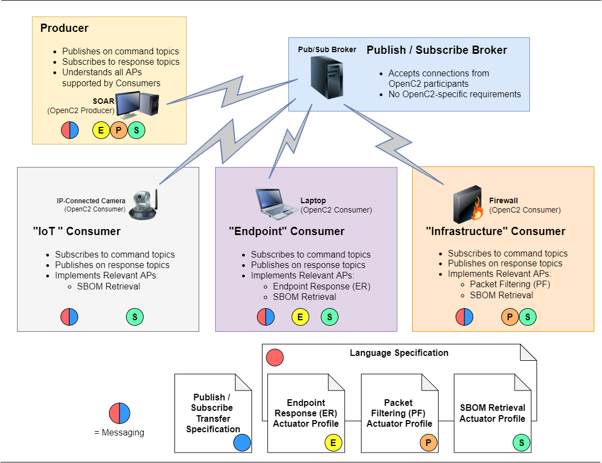

# Information Modeling Tools
This repo contains software to:
* Process [JADN](https://docs.oasis-open.org/openc2/jadn/v1.0/cs01/jadn-v1.0-cs01.html)
information models (abstract schemas) used to define 
[OpenC2](http://docs.oasis-open.org/openc2/oc2ls/v1.0/oc2ls-v1.0.html)
content as well as other types of structured data, e.g., Software Bill of Materials (SBOM) files
* Validate data against an information model

To get started, install the JADN and Fire packages into a Python 3.8 or newer environment:
* `pip install jadn`
* `pip install fire`

### Translate Information Models into Multiple Formats
The `make-artifacts.py` script reads each source schema stored in the `Schemas` folder,
creates an `Out` folder, and converts each schema into multiple output formats.
Source schemas can be in JADN, JADN IDL, or HTML format.
Output formats are:
* JADN - native JSON data
* JADN IDL - plain text information definition language
* Markdown tables - the format used in current OpenC2 documentation
* HTML tables - themeable tables (an example style is included in the Out folder)
* PlantUML diagram - viewable at http://www.plantuml.com
* Dot diagram - viewable at https://sketchviz.com/new
* JADN Core - native JSON data with all extensions removed

The script also creates a JSON Schema file corresponding to the JADN information model.

### Resolve Namespaced References
The OpenC2 language specification and actuator profiles each have their own schemas.
But as described in the OpenC2 architecture, OpenC2 producers and consumers are "devices",
each of which supports the core language plus a combination of one or more actuator profiles.
The process of combining multiple published schemas into a single device schema is called
"resolving".

A JADN package (file) can import type definitions from other packages using a namespace.
The `resolve-references.py` script reads a specified package from the Schemas folder
and replaces namespaced type references with the full type definition from the referenced
package.  The result is a single self-contained package stored in the Out folder with
"-resolved" appended to the filename.

The OpenC2 language specification contains two content sections: language framework
([3.2, 3.3](https://docs.oasis-open.org/openc2/oc2ls/v1.0/cs02/oc2ls-v1.0-cs02.html#32-message))
(Message, Command, Response) defined in a "Language" schema package 
[oc2ls-v1.1-lang.jadn](Schemas/oc2ls-v1.1-lang.jadn),
and common types
([3.4](https://docs.oasis-open.org/openc2/oc2ls/v1.0/cs02/oc2ls-v1.0-cs02.html#34-type-definitions))
that are shared across actuator profiles defined in a Types package
[oc2ls-v1.1-types.jadn](Schemas/oc2ls-v1.1-types.jadn).
The Language references to Types can be resolved into a single schema file containing all
definitions in the language specification with `resolve-references.py oc2ls-v1.1-lang.jadn`.

### Create Device Schema

The process to create a device schema is:
1. Create a device template starting with the language schema oc2ls-v1.1-lang.jadn
   1. edit the package, version, title, etc to reflect the name of the device
   2. edit namespaces to include only actuator profiles supported by the device
   3. delete all fields from Action, Target, Args, Actuator, and Results that are not used by any supported profile
2. Run `resolve-references.py device-slpf-v1.1.jadn` to generate the device schema
"device-slpf-v1.1-resolved.jadn" containing the device-specific tailored language framework,
the Targets, Args, Actuators, and Results defined in all supported profiles, and the
common types referenced by the profiles.

### Validate Test Data Against Device Schema
Once the schema for a device supporting one or more actuator profiles has been created,
it can be used to validate example/test data for good and bad OpenC2 commands and responses.